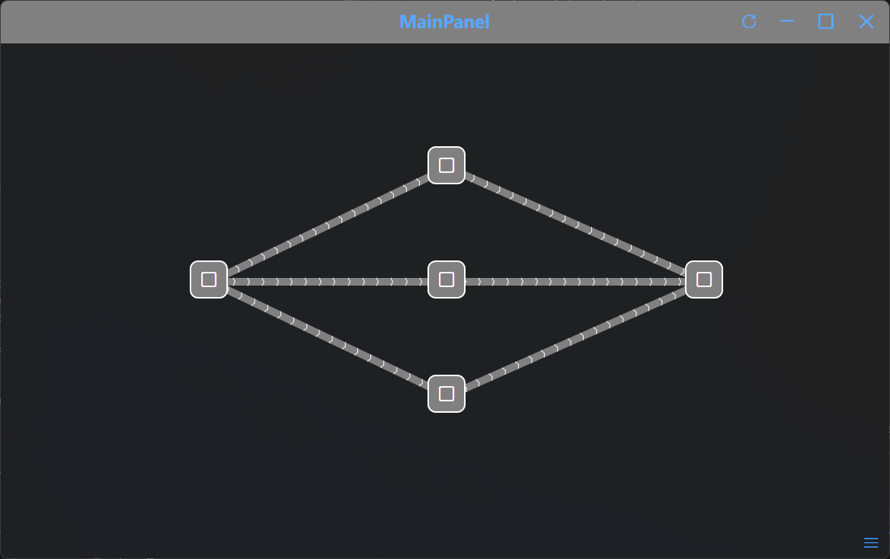

# VisualTaskTree/任务书

> A lightweight desktop tool that turns your to-do list into an interactive, icon-based task tree.  
> 一款轻量级桌面工具，把你的待办清单变成可交互的图标任务树。

---

## ✨ Features/特点
> Quickly create task icons with a right-click, add custom icon patterns, then right-click on any icon to draw a connection line to another icon.
> 通过 右键 快速创建任务图标，添加图标图案，然后 在图案上再次右键 即可画线连接到指定图标。

---

This little app is something I put together while teaching myself Avalonia and C#.  
Parts of the code are messy, inconsistent, but I’m committed to maintaining it: fixing bugs, pushing updates, and gradually adding more handy features until everything is clean and rock-solid.
这是我在自学Avalonia和C#的路上简单开发的一个小软件，有许多地方不规范甚至乱七八糟（说真的有时候我自己看都有些发懵），但我相信我会慢慢维护下去，将其变得整齐规范，以及添加更多方便的功能。
